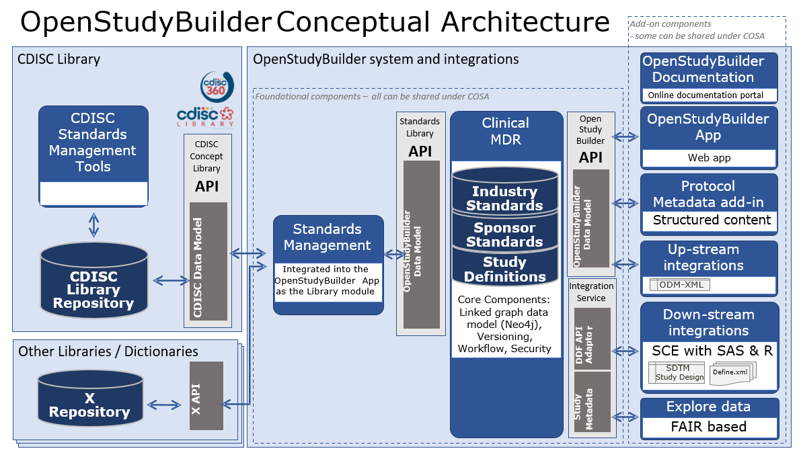
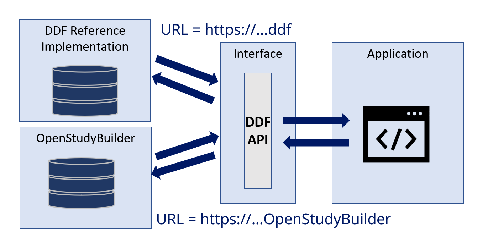
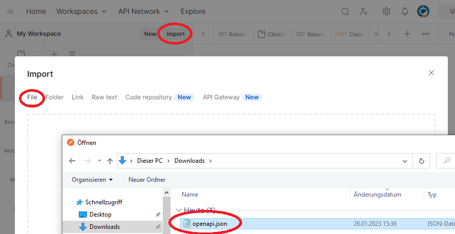
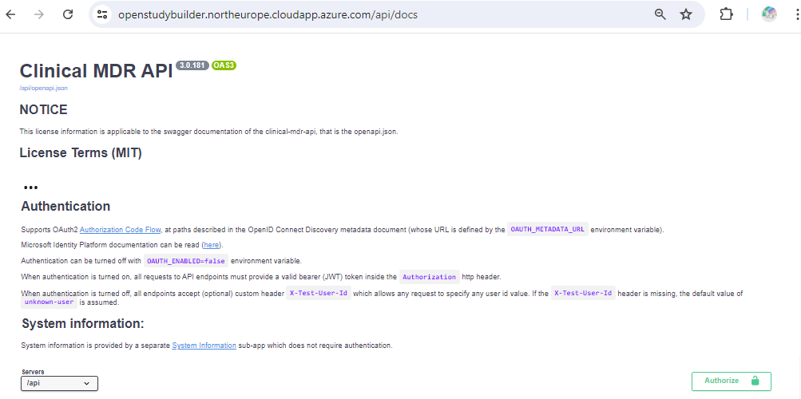
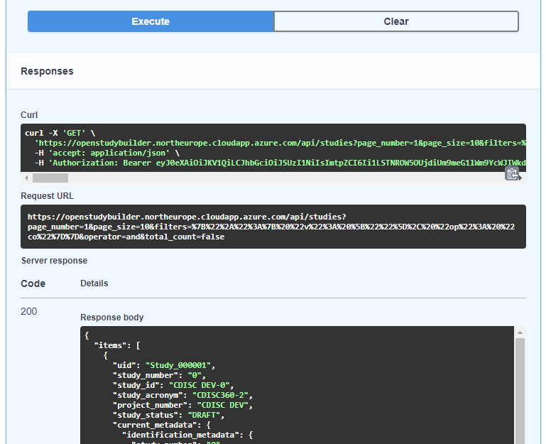
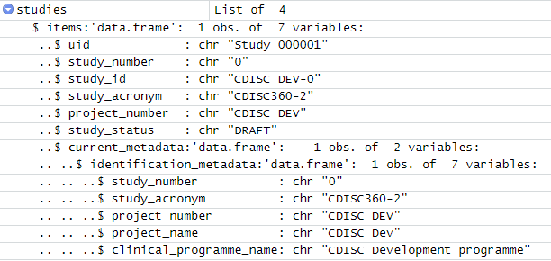
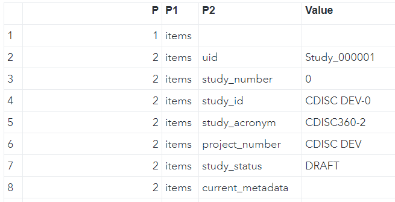

# Guide for the API

(created 2023-01-27 using v0.2) 
{: class="guideCreated"}

## Introduction

The **A**pplication **P**rogramming **I**nterface (API) is a core feature of the OpenStudyBuilder, as integrations with other tools are key to enable fully automated processes and a single source of truth. The heart of the MDR is the graph database which is a Neo4j database. One possible approach to communicating with a database is querying it directly, but APIs allow for controlled operations. This can be used to enforce business logic and domain-oriented views of data. But APIs allow for more controlled operations on the database by enforcing the business logic and providing a more domain-oriented view on the data. The OpenStudyBuilder web application displays all its contents by requesting this information from the database via the API.

The OpenStudyBuilder API allows you for example to:

- GET a list of all studies
- GET information of one study
- PATCH information for one study
- GET a list of all ODM templates (CRF templates)
- GET a list of all ODM forms
- Receive an ODM XML for a given template

## API Definition

!!! quote

    An application programming interface (API) is a way for two or more computer programs to communicate with each other. It is a type of software interface, offering a service to other pieces of software. A document or standard that describes how to build or use such a connection or interface is called an API specification.[1]

[1] Wikipedia entry for API, [https://en.wikipedia.org/wiki/API](https://en.wikipedia.org/wiki/API)
{: class="imageDescription"}


{: class="imageParagraph"}

Figure 1: Simplified API process
{: class="imageDescription"}

## OpenStudyBuilder API Design

The OpenStudyBuilder architeture is utilizing the API for dedicted connections. APIs are not only available for the OpenStudyBuilder, but are utilized by many other tools as these make the communication between systems much easier. 


{: class="imageParagraph"}

Figure 2: OpenStudyBuilder Conceptual Architecture
{: class="imageDescription"}

Let us start on the left side. The CDISC Library expose its data through an API, so this can be used by a program to load relevant data. Other library and dictionary providers might have an API where the data can be loaded from one system to another automatically. For the OpenStudyBuilder we have standard import programs in place which read the data from the CDISC API and stores the data in the database using the OpenStudyBuilder API - there are many parts in the API just responsible for standard imports.

On the right side is the OpenStudyBuilder application which is also only communicating with the database through the OpenStudyBuilder API. Other tools like a protocol tool (not open-sourced currently) also access the data needed for their use-cases through the API. Addition use-cases could be, but not limited to, EDC tools which use the API to import and export ODM-XML metadata updates.

The OpenStudyBuilder API is very powerful and contains a lot of endpoints to work with the data. Tool integrations are typically very difficult, but will be easier by utilizing APIs. To integrate multiple systems is still challenging, as every tool is using different interfaces. To overcome integration issues, the [TransCelerate DDF](https://www.transceleratebiopharmainc.com/initiatives/digital-data-flow/) project is working together with CDISC on API standards. The OpenStudyBuilder is working on a DDF-API-Adaptor which will be included in one of the next coming releases. This enables any software supporting the DDF-API standard to be also working with the OpenStudyBuilder.


{: class="imageParagraph"}

Figure 3: TransCelerate DDF API - Example
{: class="imageDescription"}

There could be an EDC tool supporting the DDF standards. By connecting just the different database, for example by specifying the URL in a configuration file, the original tool would not need any further integrations. Currently the DDF API might not be as powerful as required - for example the native API provides many additional features which are very valuable for EDC tools - but it is in development and throughout the years we are expecting the DDF API adaptor to contain all required functions.

## API and Execution

### OpenAPI and Swagger

For the API development and usage, there are excellent standards and tools available. The [OpenAPI](https://www.openapis.org/) is a very common format for API specifications. This specification, which is available in the json format, can be important into many API tools - for example into [Postman](https://www.postman.com/), a commonly used API interaction tool. Additionally, there is the [Swagger](https://swagger.io/) documentation which also allows executing API calls easily. 

In the OpenStudyBuilder you can download the OpenAPI either from the [repository](https://gitlab.com/Novo-Nordisk/nn-public/openstudybuilder/OpenStudyBuilder-Solution/-/blob/main/clinical-mdr-api/openapi.json) directly, or you can click the link in the Swagger documentation top right. This you can then load it into Postman to "Create a new collection". The Swagger documentation is an available component within the OpenStudyBuilder package - in the sandbox environment you can access this simply through a [URL](https://openstudybuilder.northeurope.cloudapp.azure.com/api/docs#/). In the other environments this is also available, for example by using a docker environment the default URL is [http://localhost:5005/api/docs](http://localhost:5005/api/docs).


{: class="imageParagraph"}

Figure 4: Download OpenAPI.json from Swagger documentation
{: class="imageDescription"}


{: class="imageParagraph"}

Figure 5: Importing OpenAPI.json into Postman
{: class="imageDescription"}

There are different operations you can do with an API. The following standard operations are typically used for tasks:

Operation | Description
--|--
GET | Retrieve data
PUT | Updates data
POST | Sends data for processing
DELETE | Removes data
PATCH | Updates data

### Swagger API Documentation


{: class="imageParagraph"}

Figure 6: Swagger API documentation (top section)
{: class="imageDescription"}

The top section contains some general information including license information. Then there is an authentication section. If you have not changed the settings, the docker environment will have no authentication. But for the sandbox environment, you do need to authenticate. You can simply click "authorize" and then in the pop-up again "authorize" to allow the API calls to be executed later on. The specifications related to authentication flow depends on how the specific authentication has been set up in an environment. The specifications related to authentication flow depends on how the specific authentication has been set up in an environment.

You can see which endpoints are available. By being authorized you can additionally also execute these. There are many endpoints available which are grouped logically. Of course, it might be tricky to find the correct endpoint when you are not familiar with the used terminology used.

The ODM prefixes are for example connections related to ODM and CRF items. You can for example see CRF templates and download these in the ODM-XML format. The corresponding functionality in the app is located under "Library -> Concepts -> CRFs". The CT is all related to the controlled terminology management which is available in the application via "Library -> Code Lists".

### Swagger API Execution

To execute an API call within this website is very easy. After authentication we can search for "/studies" to get to the related calls. The short description gives a good overview of what call will do. 


{: class="imageParagraph"}

Figure 7: Swagger API documentation (Studies section)
{: class="imageDescription"}

When the "Get /studies" section is enlarged, many options are available. You might want to restrict the resulting data, filter by various conditions. Below you see the structure of return values which you might receive on success or failure. We can click on "Try it out" to be able to fill out the different parameters and execute that API command.

!!! note

    Please note that the "filters" is pre-filled with an example `{"*":{ "v": [""], "op": "co"}}` - you need to remove this to get a result. This "filters" option is available and pre-filled in many calls, so please remember to remove those.

After executing this API call, you get a response.


{: class="imageParagraph"}

Figure 8: Swagger API Execution (/studies)
{: class="imageDescription"}

You receive a "Curl" statement, a "Request URL" and a "Response body". The "Response body" displays the data from your API call. The result is the "answer" to the API call question. It is available in JSON format, which is ideal to be processed further programmatically. The "CDISC DEV-0" study has for example the UID of "Study_000001". This is the unique identifier and is needed if you want to do follow up calls where you receive additional information or even change information.

The **"Request URL"** is nice to re-use in a browser or HTTP request. When using no authentication (for the docker environment for example), you can copy the URL into a browser and see the same result - just not formatted. If you want to use this HTTP request in any other tool like a web or R-Shiny application, you can simply use this URL. That's very generic and can be used from nearly any programming language. When you use authentication, e.g., like we have for the sandbox test environment, you need to take care for this and can work with that as well.

Most API tools support **CURL** requests. If you use a Linux system or a windows bash, you can even execute this CURL command to get the response. This CURL request also contains authentication (the bearer token in this case).


{: class="imageParagraph"}

Figure 9: CURL command executed in Git Bash in Windows
{: class="imageDescription"}

### Security Comments

In the OpenStudyBuilder project, authentication and authorization is being handled with OAuth 2.0 and OpenID Connect. Depending on the use-cases of OpenStudyBuilder and how you're connecting to the API, different authentication flows exist, such as client credentials flow, device code flow and authorization code flow. You should familiarize yourself with the authentication context that you're going to implement. For testing purposes, you can get an access token from the OpenStudyBuilder sandbox environment and using this for Bearer token authentication in other software solutions connecting to the API, such as SAS, R, or Postman. Such workflows should not be used for anything else than testing.

### R example

As mentioned, this API can be called in any other kind of software. Let's use as example an R application connecting the sandbox environment with authentication. There are different packages available for http and CURL requests. The following example is using the httr package. As this is for test purposes, we are using a bearer token for authentication for simplicity.

```R

# CURL example to get API results from OpenStudyBuilder
#
# Remark - you can get the current bearer token by executing by calling the API from the browser and copy the token
#   goto - https://openstudybuilder.northeurope.cloudapp.azure.com/api/docs#/Studies/get_all_studies_get
#   click "authorize" top right lock symbol, then "authorize"
#   click "try it out"
#   remove everything from the "filters" field
#   click "execute"
#   copy the bearer token from the CURL command (long string after "-H 'Authorization: Bearer ")
#

# setup for sandbox environment
api_url <- "https://openstudybuilder.northeurope.cloudapp.azure.com/api"
api_bearer <- "...."    # get your specific one

library(httr)

response <- GET(paste(api_url,"studies", sep = "/"), add_headers(Authorization = paste("Bearer", api_bearer)))
studies <- jsonlite::fromJSON(rawToChar(response$content))
cat(studies[][["items"]][["uid"]], studies[][["items"]][["study_id"]])


response <- GET(paste(api_url,"ct/terms?codelist_name=Sex", sep = "/"), add_headers(Authorization = paste("Bearer", api_bearer)))
ct_sex <- jsonlite::fromJSON(rawToChar(response$content))
print(ct_sex[["items"]][["name"]][["sponsor_preferred_name"]])
```

We can simply get the resulting JSON file from a GET call and parse this into an R data frame. The first example ready in all studies which are available using the "/study" endpoint. Currently there is just one study available.

We can use also any other available endpoint. The second example shows how the "Sex" controlled terminology is downloaded.

Output:

```
> cat(studies[][["items"]][["uid"]], studies[][["items"]][["study_id"]])
Study_000001 CDISC DEV-0> 
> 
> print(ct_sex[["items"]][["name"]][["sponsor_preferred_name"]])
[1] "Female"   "Intersex" "Male"     "Unknown" 
```


{: class="imageParagraph"}

Figure 10: R data frame from API studies object
{: class="imageDescription"}

### SAS example

SAS is still the most common used programming language for clinical study evaluations. SAS provides the opportunity to perform API calls and process the response further. The following example is using a bearer authentication for the "/studies" endpoint. The API is calles through an HTTP request using PROC HTTP. The final result is a JSON file which can be transformed into a SAS library through the JSON library engine.

```sas
OPTIONS QUOTELENMAX;

/* define the bearer token and API endpoint variable */ 
%let bearer_token = eyJ0eXAiOi....; /* enter your token here */
%let api_endpoint = https://openstudybuilder.northeurope.cloudapp.azure.com/api/studies; 

/* make the API call */ 
FILENAME response temp; 

PROC HTTP URL="&api_endpoint" METHOD="GET" OUT=response;
	debug level = 1;
	HEADERS 
		"Authorization" = "Bearer &bearer_token"
		"accept" =  "application/json"; 
RUN;

/* Read in the JSON into a library */
LIBNAME response JSON;
```

The "ALLDATA" dataset in the assigned library containing the full content of the response. 


{: class="imageParagraph"}

Figure 11: ALLDATA dataset containing response
{: class="imageDescription"}

The first level information for the studies are contained in the "ITEMS" object, which can be seen by opening up the corresponding "ITEMS" dataset. At this timepoint there are three studies available in the OpenStudyBuilder sandbox environment.


{: class="imageParagraph"}

Figure 12: ITEMS dataset containing response information for ITEMS
{: class="imageDescription"}