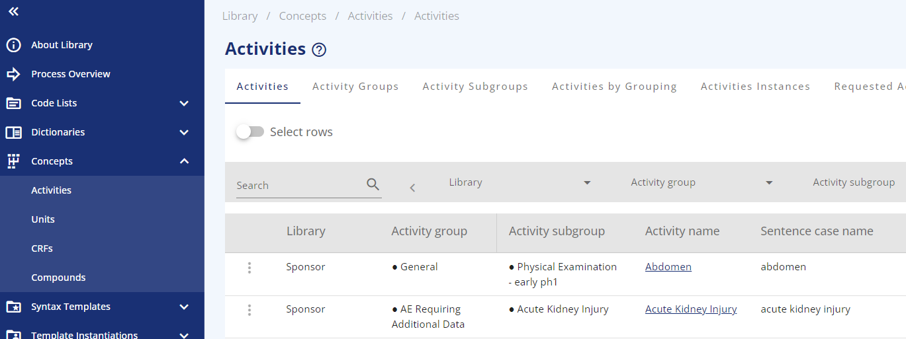
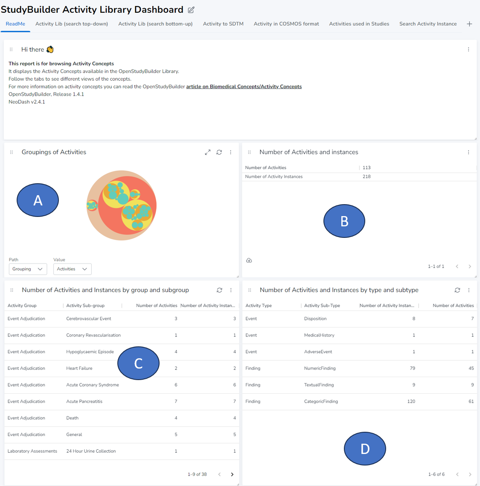
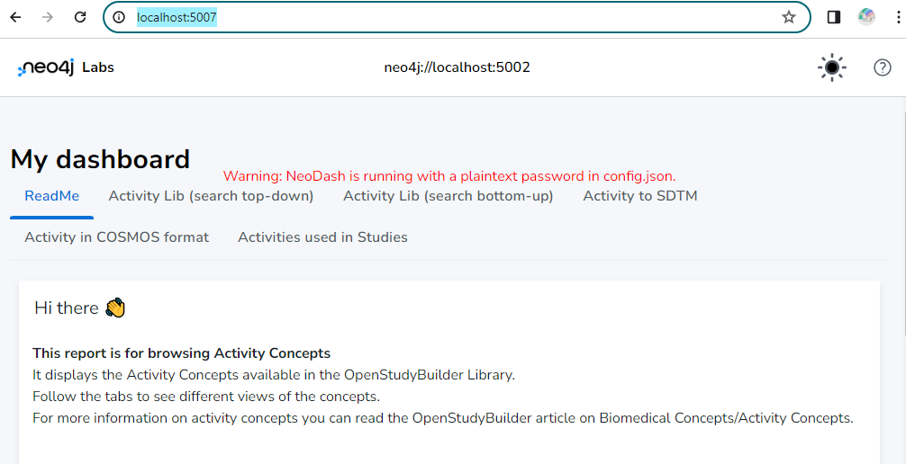

# Guide for Activity Dashboard {: class="guideH1"}

(created 2024-01-15 using v0.7.3 and the LATEST dashboard) 
{: class="guideCreated"}

## Activity Introduction

Additionally to the Application, a Neo4j Dashboard is available to browse and understand biomedical concepts which are the activities in the OpenStudyBuilder. Please check out the [guide for Biomedical Concepts](./guide_activity_concept.md) to get an understanding of the definition and usage of biomedical concepts for activities.

Within the OpenStudyBuilder application, you can define and see the activities in the "Library" -> "Concepts" -> "Activities" part.



The activities are managed in groups and subgroups. Whereas the "Activity" defines all general attributes, the "ActivityInstance"  is the specific identification of the logical observation. This includes reference to context and qualifier values. For example, this includes references to ADaM BDS PARAM/PARAMCD or column name in ADSL, it also includes internal unique identification as well as internal topic code. This will enable unique identification of source data, representation in SDTM by several qualifiers, and representation in ADaM BDS by PARAMCD value.

The underlying data model documentation is available in GitLab and can be found [here](https://gitlab.com/Novo-Nordisk/nn-public/openstudybuilder/OpenStudyBuilder-Solution/-/tree/main/neo4j-mdr-db/model?ref_type=heads){target=_blank}. To understand the activities better you might want to look at the following visualizations from the OpenStudyBuilder data model. Please be aware that the models might be enhanced and evolve.

File | Description
-- | --
logical-model-high-level-activity-concept.graphml | High level Logical Model for Activity Concept Class
logical-model-activity-bc-new.graphml | Logical Model for Activities and Assessments (Concepts)
logical-model-activity-bc-new-nested.graphml | Logical Model for Activities and Assessments with nested information

## Activity Dashboard

The activity dashboard is an option to view the activities from a different perspective. Especially when working with biomedical concepts from the OpenStudyBuilder and others like the CoSMOS, it might be valuable to have a database closer access as the dashboard provides. When you have access to the OpenStudyBuilder sandbox environment, you can simply browse the dashboard online: [https://openstudybuilder.northeurope.cloudapp.azure.com/neodash/?](https://openstudybuilder.northeurope.cloudapp.azure.com/neodash/?){target=_blank}. You can also install the dashboard locally - instructions are available [below](./guide_bc_dashboard.md#load-dashboard-in-local-envirionment).

The dashboard is organized in different tabs supporting different purposes. The first tab provides a quick overview. The next two tabs are designed to navigate the "Activity Lib" either via a top-down or bottom-up search. Then there is the option to get Activities to SDTM using a specifig implementation guide. As the CDISC collaboration with the CoSMOS initiative is very important, there is also a mapping of activities in the OpenStudyBuilder to the CoSMOS format and finally there is an overview of the activity usage in studies.

### Introduction / ReadMe

The first dashboard page gives an overview of activities, their grouping and the types including counting statistics.



The first graphic (A) shows the "Groupings of Activities", which shows the available types and sub-types. Next to this, there are the numbers of activities and instances (B). An instance is the concrete form which is used in studies to observe something. The table for "Number of Activities and Instances by group and subgroup" (C) can be used to get an overview of the groups and subgroups whereas the table "Number of Activities and Instances by type and subtype" shows the overview with type and sub type (D).

### Activity Lib (search top-down)

The second tab allows you to look at activities from the top-down perspective. You can browse the class and sub-class followed by the group and subgroup. 


After the description, there is a selection area where the activities can be filtered until the level of a subgroup (A). The "Number of activities" graph updates with the concrete numbers when you filter all activities (B). Depending on your selection, the "List of activities" shows then the actual activities matching your filter (C). When clicking one concrete activity, the details of this activity are displayed (D).


We can see that the `PULSE RATE` has an associated domain, a test_name_code which consists of a code and a name, a unit_dimension and a standard_unit.

Below we can see the representation of that activity as in the graph database in the logical view or physical view (E). The complex model enables us to link all information. The following screenshot shows the logical view for `PULSE RATE`. 


The last part displays information about concrete activities instances. There is the selection part (F) and the display as logical view part (G). 

When we select for example `ALBUMIN` as activity, it could have three different instances depending on the purpose of activity collection. 


There is an instance for "Albumin Urine", where the specimen is "Urine", the second instance is for the specimen "Serum" and the third one is collected differently with the purpose for "AE Requiring Additional Data".

### Activity Lib (search bottom-up)

The search bottom-up tab enables you to search for a concrete activity or multiple activities in the search field (A). For the concrete activity the groups (B) and sub-groups (C) are displayed. Out of these groups you can select one (D) where the details are displayes in a list (E).


### Activity to SDTM

By linking the activities to concrete SDTM items in a specific implementation guide, corresponding SDTM items can be displayed for each activity.


## Setup

## Load dashboard_OSB_v0_6_1 dashboard in local environment

**Remark** This dashboard is not the latest as installed on the sandbox. The newest dashboard will be coming with version 0.8 at least.

With OSB version 0.8 the dashboard is planned to be pre-loaded. From that version on, the dashboard will be accessable simply through a port, which is [http://localhost:5007/](http://localhost:5007/){target=_blank} when you work with the defaults.

To load the dashboard the version `Activity_Library_content_dashboard_OSB_v0_6_1.json` into the local environment, a few steps are required.

- Adopt the JSON file to use the correct "database" (search/replace)
- Use [http://neodash.graphapp.io/](http://neodash.graphapp.io/){target=_blank} to connect to the local neo4j database
- Load the JSON file and save this with a name 'My dashboard' (case sensitive)
- When loading [http://localhost:5007/](http://localhost:5007/){target=_blank} the dashboard will appear

When using the dashboard version "Activity_Library_content_dashboard_OSB_v0_6_1", we need to update the database name with the one used in the current environment. We can open the Neo4j database browser with this URL: [http://localhost:5001/browser/](http://localhost:5001/browser/){target=_blank}. By clicking the database symbol at the right, we can select different databases. There should be a database named `mdrdb-2024.01.05-08.52` or similar. This is the database name we need.

The next step is to open the available dashboard which is located in `\neo4j-mdr-db\neodash_reports`. The name of the dashboard is `Activity_Library_content_dashboard_OSB_v0_6_1.json`. We open this file for example in a simply editor and replace all occurences of `mdrdev1` with the name of the actual database, for example with `mdrdb-2024.01.05-08.52`.

Now we open the neodash web application under [http://neodash.graphapp.io/](http://neodash.graphapp.io/){target=_blank} and open our existing dashboard. First we need to create a "New Dashboard". Here we can connect to our local database. If you have not changed the default settings for the docker setup, your port will be `5002`, the username `neo4j` and the password `changeme1234`. Make also sure to enter the correct default database which could be `mdrdb-2024.01.05-08.52`.


When you click on the right pane, a menu with all dashboards opens up. You can click the `+` next to Dashboards to import the json file. Either copy and paste the content from the modified file or select the file itself. Now the dashboard is loaded.

You might receive a upgrade notification:


When you do a refresh, you can start your existing dashboard by clicking "Existing Dashboard".

Now you can change the name of the dashboard to 'My dashboard' by clicking the edit button next to the title. After clicking "stop editing", this is the new title. On the left title menu, click to the cloud icon to save this dashboard on your database. Now, when you open up the dashboard local URL, this dashboard will be shown: [http://localhost:5007/](http://localhost:5007/){target=_blank}.



## Create own dashboards

You can also design your own dashboard. For this you can visit [http://neodash.graphapp.io/](http://neodash.graphapp.io/){target=_blank} and create a new dashboard. By clicking on the grey box, you can add additional elements to the dashboard. For example, you could create a "markdown" box to start with a simple description. Click the "settings" on the box to edit the type - for markdown you can simple edit the content and apply it by pressing "play". 

You can also create a table output. For this you can select the type "Table". Make sure to choose the correct database, which could be for example `mdrdb-2024.01.05-08.52`. Then in the coding box you can put the cypher query in. For example the following to get a simple table with all your compounds:

```cypher
MATCH (n:CompoundValue)
RETURN n.name AS `Compound name`
```

By pressing "play", the query is executed and the result (or the error message) is displayed. You can also resize the boxes and position them in any order. In this way, various dashboards can be designed.

**Tips**

To investigate which types of nodes are available, which connections are available and to work on complex cypher queries, you might want to access the neo4j database browser - in your local installation it's available via [http://localhost:5001/browser/](http://localhost:5001/browser/){target=_blank}. Make sure you select the correct database. You could click on a node label to see which nodes are available. By clicking on "CompoundValue", you would see different compounds. When you click on one node, you see the different attributes. Additionally, you can click on the "tree" to show all connections from this node to somewhere else.


If you are not familiar with Cypher, you might find ChatGPT or similar tools helpful.

To get a better understanding of the database structure, you might want to check out the model as documented in GitLab [`/neo4j-mdr-db/model`](https://gitlab.com/Novo-Nordisk/nn-public/openstudybuilder/OpenStudyBuilder-Solution/-/tree/main/neo4j-mdr-db/model?ref_type=heads){target=_blank}.