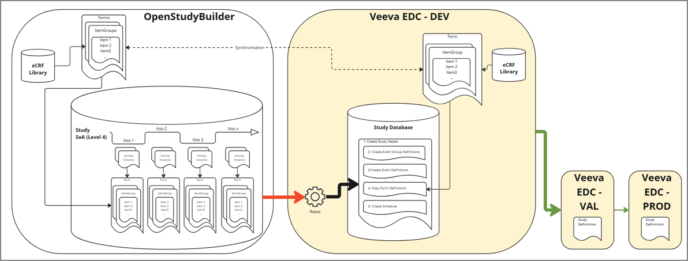
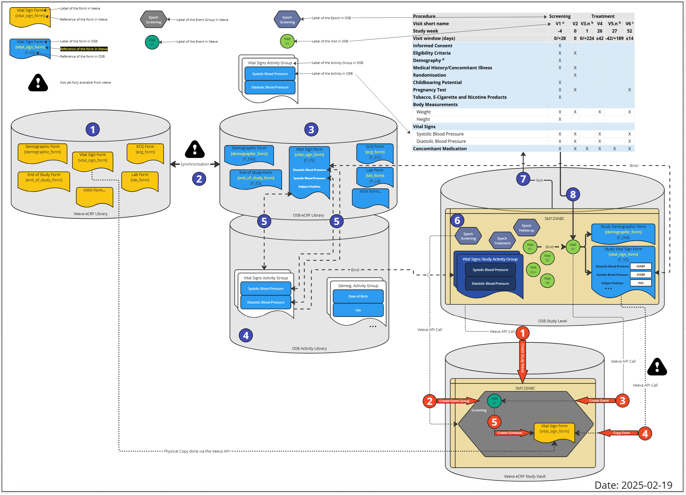
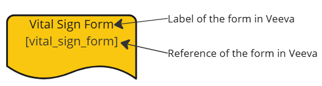

# EDC Integration Strategies {: class="guideH1"}

(created 2025-07-17) 
{: class="guideCreated"}

## Overview of EDC Integrations

The OpenStudyBuilder is not an EDC system, nor should it replace one. But it contains metadata to enable EDC setup automation and enables integrations. The current overview provides a list of EDC systems and the integration strategies that are currently available, tested or planned.

EDC System | Status | Integration Strategy
--- | --- | ---
Oracle Clinical One | Live | API-based integration, "Automated Study Builder Application" available, utilizing extensions for edit checks and more, developed by Oracle
Veeva EDC | PoC | API-based integration, limited features due to currently missing API endpoints on Veeva side, development by OpenStudyBuilder team with ongoing improvement discussions
Marvin EDC | PoC | ODM.xml export and import, tested by EvidentIQ
REDCAP Cloud | PoC | ODM.xml export and import, tested by University community
[ODM.xml based EDC Systems] | theoretical support | ODM.xml export and import, no specific other EDC system tested yet
Medidata Rave | N/A | None - needs to be requested by PharmaCos and someone willing to implement it 

## CRFs in OpenStudyBuilder

The OpenStudyBuilder supports a **CRF library** on the standards level. CRFs can be designed and visualized in the OpenStudyBuilder containing forms, item groups and items in alignment with the ODM.xml standard. Furthermore, extensions and aliases can be defined to support the EDC system specific requirements. Please check out the guide on [CRF](./guide_crf.md) for more details. We are currently working on binding CRF elements to activities using biomedical concepts. For more details on this, please refer to the [Activity Concepts](./guide_activity_concept.md) and [Beyond Concepts](./guide_beyond_concepts.md) for detailed information. Unless this work is done, a **study CRF is NOT available**.

## Veeva EDC Integration

The OpenStudyBuilder team is currently working on a continuous improvement of our proof of concept for the Veeva EDC integration. The integration is based on the OpenStudyBuilder and Veeva's APIs. The goal is to enable the creation of studies in Veeva EDC based on the CRF library, metadata and study design defined in OpenStudyBuilder.

### High Level Overview

The following high-level overview shows the main idea.

{: class="imageParagraph imageMaxWidth600"}

Figure 1: High Level Overview of Veeva EDC Integration Plans
{: class="imageDescription"}

We plan to synchronize the Veeva EDC CRF Library and the OpenStudyBuilder CRF library. These OpenStudyBuilder CRF library elements are then linked to activity instances which are used in the study specific Schedule of Activities (SoA) - we name this SoA Level 4. The long-term vision is to link the elements of the OpenStudyBuilder CRF library to activity instances that are used in the study-specific Schedule of Activities (SoA) - which we refer to as SoA Level 4. In our current proof of concept (PoC), which serves as the foundation for the development of SoA Level 4 when creating a study in OpenStudyBuilder, we can trigger an automation that will set up the Study in Veeva EDC based on the OpenStudyBuilder SoA Level 3, in combination with some workarounds using Neodash reports.

{target=_blank}
{: class="imageParagraph"}

Figure 2: Overview of Veeva EDC Integration Plans
{: class="imageDescription"}

**In short** - the long-term vision is the following:

- Maintain CRF Forms, ItemGroups and Items in Veeva EDC with additional attributes, for example system display configuration
- Synchronize CRF objects between OpenStudyBuilder and Veeva CRF library, supported by a compare tool (this will be done via API after Veeva's release)
- Select activity instances in Schedule of Activities for visits (which are linked to CRF objects - Level 4). 
- Perform automation setup calling the Veeva APIs to setup a new empty study, create event groups and events, copy the CRF forms and create the schedule.
- After study setup in DEV, use this new study in VAL and PROD

Note: We're in dialog with Veeva to prioritize new APIs on their roadmap that will enable OpenStudyBuilder to synchronize objects between libraries at both the library and study level.

**Explanation** 

In the OpenStudyBuilder the CRF relevant information is defined in the library module in Forms, ItemGroups and Items. The Veeva EDC System contains also a CRF Library module storing the same. The idea is to have a synchronization job to keep both libraries containing the same high level information, containing linkage information in OpenStudyBuilder. Due to the limitations of the current version of the Veeva API, the current plan is to maintain and update the form information within the Veeva system and create the corresponding objects in OpenStudyBuilder via an automation job.

A further step is required to update and maintain the data specifications. Next to activities which define high-level meaning, we need to define activity instances - which is a concrete definition required for data specification. This contains next to the final SDTM location for example additionally the form, item and item group links. This is typically done by a standards function at the Library level of the OpenStudyBuilder.

On study setup, an activity is selected for the schedule of activities which is used in the clinical protocol, after the Epoch and the Visits have been created. Then these activities are further fine-tuned with selecting the activity instances. By selecting the activity instance, the linkage of a selected activity and the corresponding required CRF elements are available, for each dedicated visit.

This specification can now be used to generate a very specific formatted JSON file, that can then be consumed by a Python script that is calling the Veeva API to setup the study in Veeva EDC. We are working on a process (robot), to setup the Veeva CMDS study database:

- Create Study Master (this is an empty new study in Veeva)
- Create Event Group Definitions (this is a group of events - working like a Cycle in an oncologic study)
- Create Event Definitions (based on the OpenStudyBuilder visits used by the SoA)
- Copy Form Definitions from the Veeva CRF Library (based on the Activity Instances selected in the SoA, linked to the eCRF forms)
- Create Schedule (binding the Veeva Forms to the Event created before)

This is then checked in the Veeva EDC system and will then be used for the study setup in VAL and PROD.

### Detailed Plan

Actually, to see the details of the elements and how this is all linked together, a more detailed view is required. The following section describes additional details. 

{target=_blank}
{: class="imageParagraph"}

Figure 3: Detailed Overview of Veeva EDC Integration Plans
{: class="imageDescription"}

The following legend is used to describe the elements:

Description | Icon
--- | ---
Veeva EDC Form | {: class="imageMaxWidth400"}
OpenStudyBuilder Form | {: class="imageMaxWidth400"}
Steps not fully supported | {: class="imageMaxWidth400"}
Veeva event group | {: class="imageMaxWidth400"}
Veeva event label | {: class="imageMaxWidth400"}
OpenStudyBuilder Epoch | {: class="imageMaxWidth400"}
OpenStudyBuilder Visit | {: class="imageMaxWidth400"}
OpenStudyBuilder Activity | {: class="imageMaxWidth400"}

Let's get through the process steps.

{: class="imageParagraph"}

Figure 4: Process Steps - eCRF Libraries
{: class="imageDescription"}

As a first steps, the eCRF forms are created in the Veeva eCRF Library including the ItemGroups and Items (1). An important value is the reference ID. The synchronization job (2) will create the corresponding objects in the OpenStudyBuilder eCRF library (3) using additionally the linkage information (reference ID).

{: class="imageParagraph imageMaxWidth600"}

Figure 5: Process Steps - Activity Setup
{: class="imageDescription"}

In the steps step, the activity instances need to be enhanced. Within the OpenStudyBuilder Activity Library (4), the activity (general concepts) and activity instances (dataset specifications) are managed. The activity instances are linked to the CRF elements (5). The link to the Form, ItemGroup and Item is managed in accordance with the ODM standard.

{: class="imageParagraph imageMaxWidth600"}

Figure 6: Process Steps - Study SoA Setup
{: class="imageDescription"}

In a study (6), in the OpenStudyBuilder, a schedule of activity (SoA) is created (7). In the study, epochs are defined and used along with visits. A specific activity is selected for the study protocol and further fine-tuned by selecting a corresponding connected activity instance and associated with specific visits. As the linkage information is available in the standard, the visits can bind to concrete eCRF Forms including ItemGroups and Items (8).

{: class="imageParagraph imageMaxWidth600"}

Figure 7: Process Steps - Veeva EDC Study Setup
{: class="imageDescription"}

As we are now having all required information available, the Veeva EDC setup for the specific study can be created. First (1), the study is created if not already available storing the ID back in OpenStudyBuilder. Then the event group definitions are created (2) containing the Epochs (this is a first approach). The next step created events (3) which corresponds to the visit. The form definitions are copied from the Veeva eCRF Library (4) using the ID which are stored along. Finally, the Schedule is created (5) assigning the visits to the forms.

There is a "robot" program which creates and performs the final required API calls in the Veeva EDC system. This automatic setup is performed in a DEV instance of the Veeva EDC system. Until new APIs allow for further updates, we need to perform trial specific adjustments and form additions for now when required. After setup, checks can be performed within Veeva and then the study can be setup in VAL and PROD afterwards.

## Oracle EDC Integration

Oracle has developed the **Automated Study Builder Application** to streamline the setup of studies in Oracle Clinical One EDC using OpenStudyBuilder. The tool taps into the OpenStudyBuilder CRF library and the study setup for the schedule of activities (SoA).

{: class="imageParagraph imageMaxWidth600"}

Figure 8: Overview of Oracle EDC Integration
{: class="imageDescription"}

The CRF forms, item groups and items can be enhanced using the extension mechanism from the ODM.xml standard. Oracle is using this to manage in the OpenStudyBuilder CRF library additional information like edit checks or ranges. 

The Automated Study Builder Application is the interface where the the information from OpenStudyBuilder is read and processed to setup the study in the Clinical One EDC system. Here we see how the digital data flow enables automation. 

### Demonstration Videos

Discover how Oracle's Automated Study Builder leverages OpenStudyBuilder to streamline EDC setup in Oracle Clinical One. This **comprehensive overview** demonstrates the seamless integration and automation capabilities that transform traditional study building processes (2025-07-03).

<iframe 
  id="kaltura_player" 
  src='https://cdnapisec.kaltura.com/p/2171811/embedPlaykitJs/uiconf_id/54927872?iframeembed=true&amp;entry_id=1_i20m4bvk&amp;config%5Bprovider%5D=%7B%22widgetId%22%3A%221_3n7fkv6k%22%7D&amp;config%5Bplayback%5D=%7B%22startTime%22%3A0%7D'  
  style="width: 720px;height: 400px;border: 0;" 
  allowfullscreen 
  webkitallowfullscreen 
  mozAllowFullScreen 
  allow="autoplay *; fullscreen *; encrypted-media *" 
  sandbox="allow-downloads allow-forms allow-same-origin allow-scripts allow-top-navigation allow-pointer-lock allow-popups allow-modals allow-orientation-lock allow-popups-to-escape-sandbox allow-presentation allow-top-navigation-by-user-activation" 
  title="Automated Study Builder with OSB Introduction">
</iframe>

Watch this demonstration of Oracle's intelligent study building capabilities, showcasing the powerful integration between OpenStudyBuilder and Oracle Clinical One EDC system. See how clinical data management workflows are revolutionized through intelligent automation (2024-06-14).

<iframe
  title="Intelligent Study Build - Oracle integration with OpenStudyBuilder"
  width=720
  height=400
  src="https://www.youtube-nocookie.com/embed/4-33kqSTdeY"
  frameBorder="0"
  allow="accelerometer; encrypted-media; gyroscope; picture-in-picture"
  allowFullScreen
></iframe>
