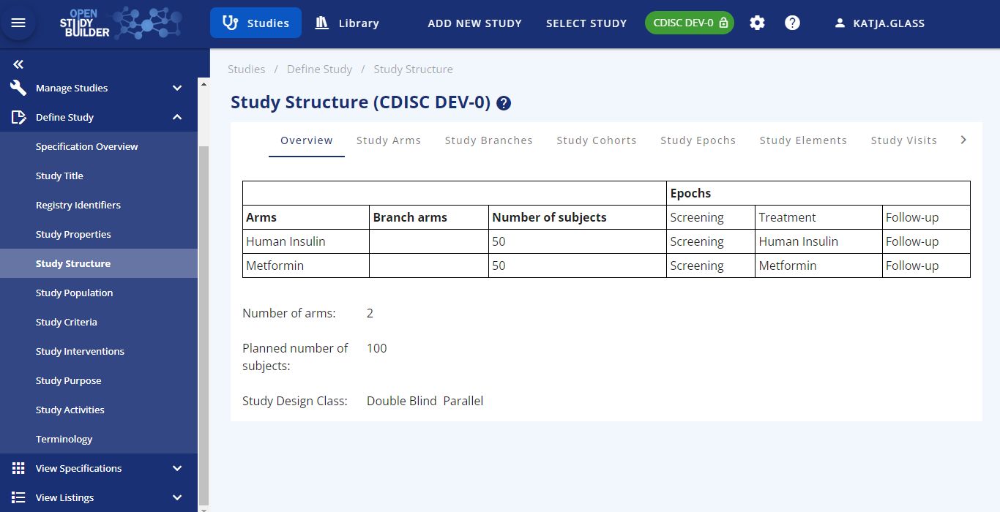

# Overview of OpenStudyBuilder Content 

## MDR & SDR 

The OpenStudyBuilder consists of two parts: 

- A Library of reusable standards  
- A study metadata definition tool 

In the following the library will be named the Clinical Metadata Repository (Clinical MDR) and Study Definition application will be named the Study Definition Repository (SDR).

## Standards library (MDR) 

In the OpenStudyBuilder you can manage different types of standards within Clinical MDR.

-	**Controlled Terminologies**
    - **Code Lists.** These can be defined by the external organisation (e.g., CDISC) or sponsor defined. ([guide available](guide_codelists.md))
    - **Dictionary Terminologies.** These are a code submission value, an identifier and a definition defined by other standards organisations than CDISC (e.g., SNOMED, MED-RT, UNII, UCUM - later MedDRA, LOINC, WHODrug, ISO, SPOR RMS etc.).  Note: Currently we only support managing subsets of these dictionary terms. 

- **Concept based standards.** We refer to concept-based standards as data standards defined in more complex structures than code-value pairs. In the OpenStudyBuilder we have grouped the ones we currently cover into the following groups related to their scope: 
    - **Activities.** These refer to our (broader) definition of Biomedical Concepts which cover clinical procedures and assessments with or without data collection. ([guide available](guide_activity_concept.md))
    - **Units.** These refer to unit definitions including relationship to UCUM, SPOR RMS and CDISC CT as well as metadata supporting unit conversions. 
    - **CRFs.** These generally refer to data collection instruments with reference to Activity Concepts as well as representation in CDISC ODM.XML format. ([guide available](guide_crf.md))
    - **Compounds.** These refer to representations of medicinal products in the protocol as well as the data collection and submission datasets. This model is in alignment with the ISO IDMP standard.

-	**Syntax Templates.** These are templates for textual representation of the main structured elements in the protocol e.g., study objectives, endpoints, time frames, criteria and activity instructions. The syntax template will support use of easily readable sentences with reference to template parameter values being linked to controlled terminologies and concept-based standards.
 
Note: Implementation is not completed for all parts and additional elements is added on an ongoing basis. Additional guides for OpenStudyBuilder will be added later. 

## Study Definition Repository (SDR)

Within the "Studies" part of the OpenStudyBuilder, metadata for the studies can be created and managed. In the current release (0.2) - the focus is on the study setup and management to support the protocol process.

 
The following actions are available for a study setup and management:

- Manage Studies ([guide available](guide_manage_studies.md))
- Define Study
    - Study Title
    - Registry Identifiers
    - Study Properties
    - Study Structure ([guide available](guide_study_structure.md))
      - Study Visits ([guide available](guide_visits.md))
    - Study Population
    - Study Criteria
    - Study Interventions
    - Study Purpose
    - Study Activities
- View Specifications
    - Protocol Elements
    - SDTM Study Design Datasets
