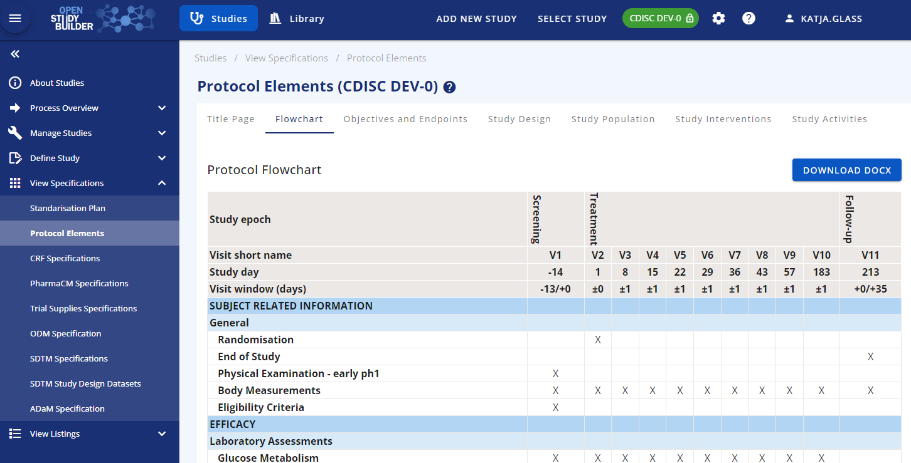
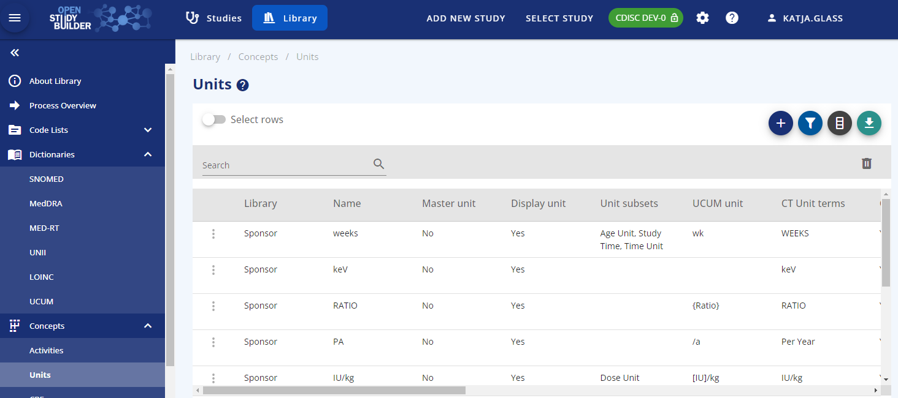
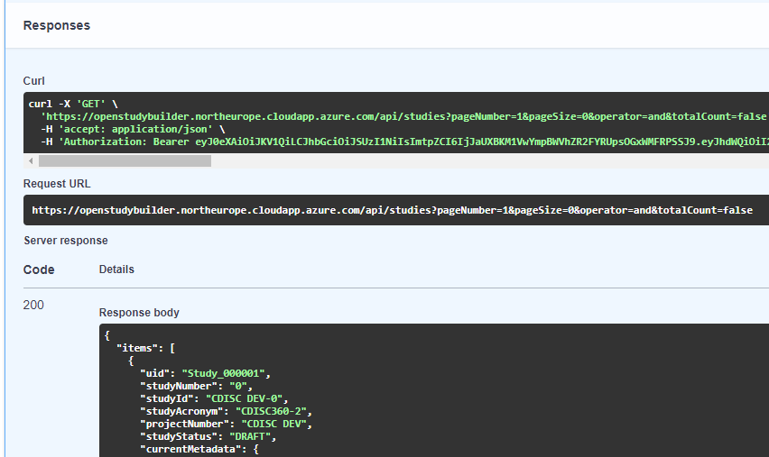
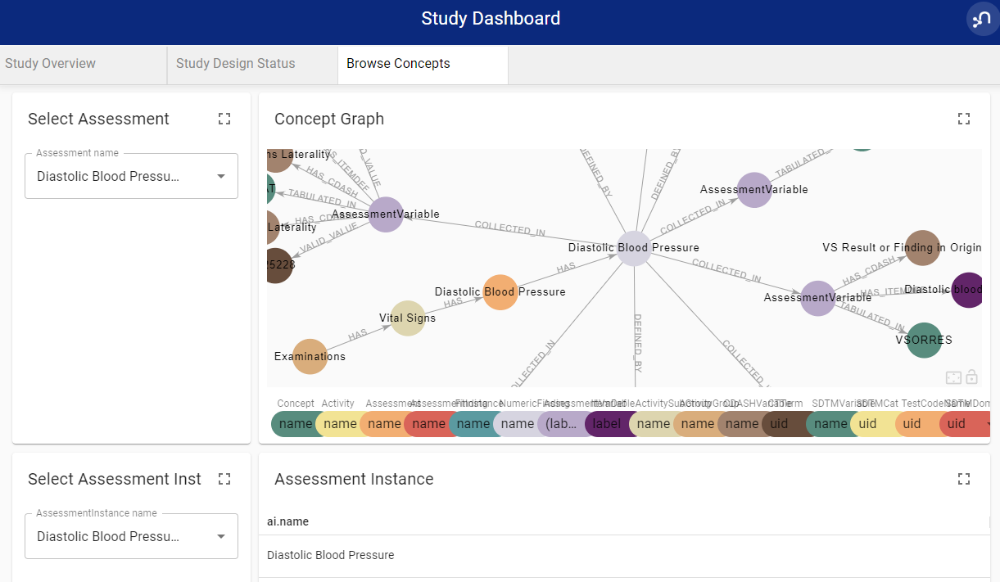
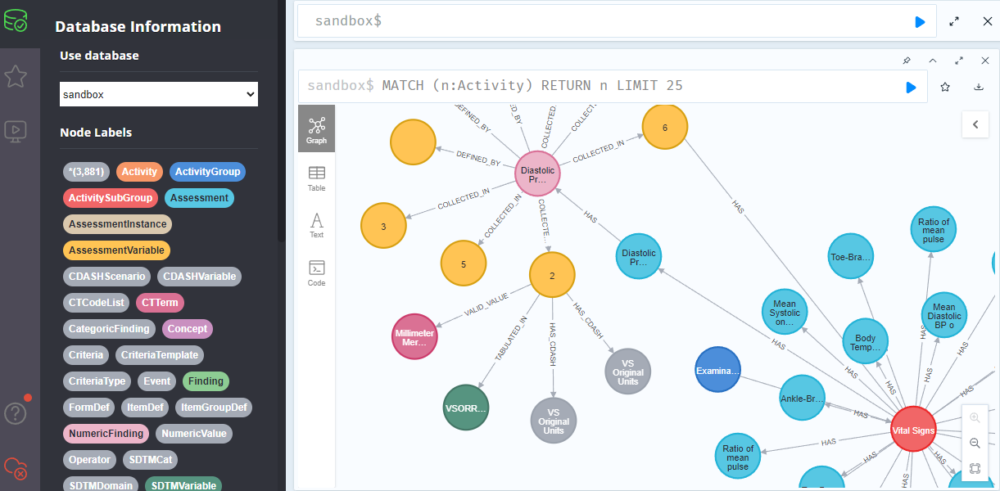

# Guide for Sandbox Environment

The OpenStudyBuilder project is progressing with a sandbox environment where people can register to play around with the open-source solution without needing to install anything. This provides an excellent opportunity to get a more detailed impression of the metadata repository (MDR). The sandbox allows for investigations on how standards can be maintained, differences identified, how studies can be created with all protocol information and much more. The API is also accessible to see the capabilities for connecting tools.  And lastly, a database browser allows for check out details of the biomedical concept. 

## Overview

The following tools and URLs are available after registration

Tool | URL | Note
--|--|--
OpenStudyBuilder App | [https://openstudybuilder.northeurope.cloudapp.azure.com/](https://openstudybuilder.northeurope.cloudapp.azure.com/){target=_blank} | main application
Documentation | [https://openstudybuilder.northeurope.cloudapp.azure.com/doc/](https://openstudybuilder.northeurope.cloudapp.azure.com/doc/){target=_blank} | product related documentation
API | [https://openstudybuilder.northeurope.cloudapp.azure.com/api/docs](https://openstudybuilder.northeurope.cloudapp.azure.com/api/docs){target=_blank} | API documentation and running API calls
NeoDash | [https://openstudybuilder.northeurope.cloudapp.azure.com/neodash/](https://openstudybuilder.northeurope.cloudapp.azure.com/neodash/){target=_blank} | Dashboard for underlying database
DB Browser | [https://openstudybuilder.northeurope.cloudapp.azure.com/browser/](https://openstudybuilder.northeurope.cloudapp.azure.com/browser/){target=_blank} | Browser for underlying database
Bloom | [https://openstudybuilder.northeurope.cloudapp.azure.com/bloom/](https://openstudybuilder.northeurope.cloudapp.azure.com/bloom/){target=_blank} | Graph broswer for underlying database

## Getting Access

To get access to the Sandbox environment, you can simply send a mail to openstudybuilder@neotechnology.com with the subject "Request Sandbox Access". Your e-mail will be used together with Microsoft authentication to access the various tools via browser. Please be aware that your mail might be exposed when you perform changes as all changes are tracked for a version history.

## The Application

The core application can easily be started with a browser. The sandbox system has already an example study which can be loaded, browsed and changed. Under the "Define Study" all relevant study protocol and trial domain information can be managed. The "View Specifications" section is available to use the entered information in different formats, e.g. for the protocol.

The general and sponsor standards can be maintained in the "Library" part of the application. Next to the functionality to browse standards like the controlled terminology from CDISC, also sponsored preferred names can be stored alongside. Extensible codelists can be added by elements and additional new sponsor codelists like for different visits can be created. Dictionaries can be maintained and browsed as well.

A core feature of the MDR and the underlying graph data model are the concepts. Standard activities can be grouped and linked. Even unit mapping for UCUM, CT and sponsor units can be maintained. The "Syntax Templates" are a fantastic feature which allows to use generic texts for protocols with semantic meaning.

## The Documentation

The tool documentation is available via the sandbox as well. This even does not need any authentication as it's a simple webpage which can be accessed [here](https://openstudybuilder.northeurope.cloudapp.azure.com/doc/){target=_blank}. Next to a user guide, you also find useful information about the architecture.

## The API

A main advantage of the OpenStudyBuilder is the openness for interfaces. The API is very powerful. Everything what the application does uses APIs which updates the graph database. This means that everything can be automated via scripts. Data can easily be loaded via the API. All the data and standards data is loaded into the solution via import scripts (mdr-standard-imports and data-imports). These can be adopted to import other data.

All information available can also be exported via API and then used by other tools. When you browse the API Swagger documentation, you can see and execute various API endpoints available.

## The Graph Database / Biomedical Concept

The heart of the application is the graph database which is using Neo4j. It contains a biomedical concept linking all kind of data which allows a high level of connectivity for automations. The NeoDash can be used to browse the concepts.

Next to NeoDash there is also the DB Browser. This can be used to browse the Neo4j database directly using the query language Cypher. After logging in via SSO (in case of issues clear cache or do a hard reload of the page), you can select the sandbox database. You can either use a direct query or get along by selecting a node and follow the connections.

Finally, Bloom is also available which allows to create and store Scenes. This is very valuable if you want to come back to a visualization or share this with others. In one of our next newsletters, we are going to have a closer look into the concepts.

### Logins

**Application**

The core application is accessible through https://openstudybuilder.northeurope.cloudapp.azure.com/. You need to register with your Microsoft account which is using the mail you had been used for registration. Click the "Login" button and use your Microsoft credentials and include also the security code which is mailed to you.
 
You can then browse studies or the library by selecting the corresponding icons in the top-bar.

**Documentation Portal**

The documentation is stored here: https://openstudybuilder.northeurope.cloudapp.azure.com/doc/. This contains a lot of documentation and easily browsable. This does not require any authentification.

**Neo Dashboard**

Via https://openstudybuilder.northeurope.cloudapp.azure.com/neodash/, the Dashboard can be used. Use the "SSO" sign in. If this is not available, then there are cookie issues. Please refresh the webpage by using no "cache", for example in Chrome you can use Ctrl + Shift and click R.

**Database Browser**

Via https://openstudybuilder.northeurope.cloudapp.azure.com/browser/, the Neo4j database can be browsed, e.g. by using Cypher for queries. You need to select single sign on (SSO) and then the browser will start. If the SSO is not available, then there are cookie issues. Please refresh the webpage by using no "cache", for example in Chrome you can use Ctrl + Shift and click R.

**Bloom**

Finally, https://openstudybuilder.northeurope.cloudapp.azure.com/bloom/ is available to access the bloom tool. You have to select SSO for login here as well. If the SSO is not available, then there are cookie issues. Please refresh the webpage by using no "cache", for example in Chrome you can use Ctrl + Shift and click R.

### Possible Microsoft Authentification Issues

Sometimes there are some issues with remembered Microsoft logins and accounts specificially as you will receive a Neo4j guest account. If you get an error like in the screenshot, then use the "logout and forgot" behind the three dots. Then choose "use a different account" and re-login with your mail and then you should receive a code via mail. If you still do not receive a mail, then refresh the page and re-enter the mail. Then receiving the mail should work. If not, please let us know in Slack as this should not happen.

