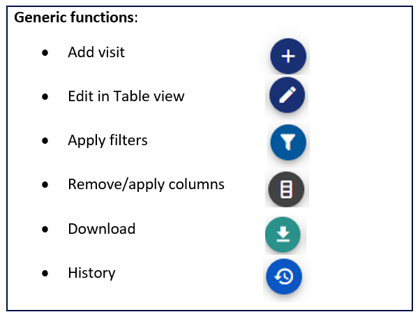
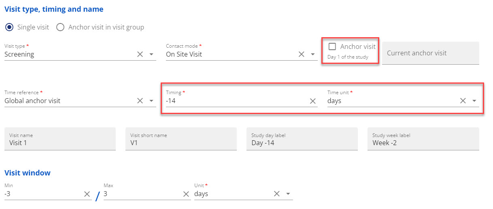
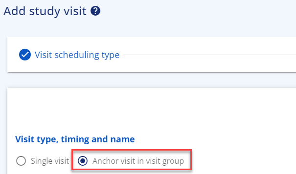
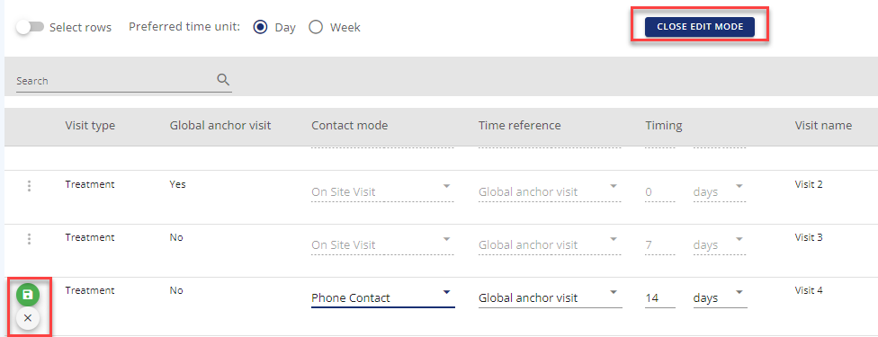

# Visits {: class="guideH1"}

(created 2023-04-17 using v0.5) 
{: class="guideCreated"}

Study visits are handled in `define study/Study Structure/Study visits tab`.

Below you will find a walk-through of the visit setup process and how you work with visits in OpenStudyBuilder.

{: style="width:60%"}
{: class="imageParagraph"}

Figure 1: Overview of possible actions for managing visits
{: class="imageDescription"}

## Adding Visits

The following visit categories are available:

Visit Category | Description
-- | --
Scheduled visit | A visit with a planned timing
Unscheduled visit | A technical visit, where data can be put for unscheduled data collection, e.g., Adverse Events
Non-visit | A technical visit for data collection for non-visit for
Special Visit | An event-driven visit, like early treatment discontinuation or repeated visits for observational studies

### Planned Visit Schedule

The planned visit schedule is typically using the visit category 'scheduled visit'. You will need an epoch you can assign the visit to.

1. For the first visit, you will receive a warning that no global anchor visit is identified yet unless you dedicate the first visit as Global anchor visit. The global anchor visit is the reference visit that should be used the calculate timing from, e.g., the randomization visit. In general, the visit table holds different timing formats to meet different needs.

2. You can refer to the global anchor visit even though you have not marked any visit as global anchor visit yet, if you know the relative timing between visits (see figure 2)

    
    {: class="imageParagraph"}

    Figure 2: Example - Assign the first visit with relative timing to global anchor as -14 days
    {: class="imageDescription"}

3. When you have created the first visit, it is visible in the visit table. If you scroll to the right, you can see the different timing variables that can be used for Schedule of Assessments (SoA), CRF, SDTM etc.
4. You can create additional visits with different visit types that refer to each other or directly to the global anchor visit. In below example, visit 2 is used as time-baseline and named to be randomization visit
5. Above the visit table, you can open a drawing of the study timeline view by using the arrow (see figure 3)
6. Below the timeline you can choose to have the timeline presented in days or weeks
7. If you place your mouse over the visit circles, you will get a tool tip showing the visit number, contact mode, visit type and timing in days and weeks

{: class="imageParagraph"}

Figure 3: Example - Showing timeline, tooltip for visit, preferred time unit
{: class="imageDescription"}

**Visit stretching across more than one day (consecutive visit days in a visit)**

You can also create a visit 'group' when one single visit expands across several days. For this you use the functionality 'Anchor visit in visit group'. The anchor visit in the visit group can be any visit within the group as you can assign the rest of the visit days before or after the anchor visit.

You find this functionality in the add visit form, where you choose 'scheduled visit', then the relevant epoch and then 'Anchor visit in visit group'. Fill in the needed information.

{: class="imageParagraph"}

Figure 4: Visit Groups
{: class="imageDescription"}

For adding additional visits to the visit group, you again choose 'scheduled visit', the relevant epoch and then 'Additional sub-visit'. This option only appears once an anchor visit in visit group has been created.

{: class="imageParagraph"}

Figure 5: Additional visits for a group
{: class="imageDescription"}
 
When adding the additional sub-visit, you only get the choice to refer to the anchor visit(s) in visit group(s).

In the visit table, all visit days belonging to this visit lasting several days will appear with the same visit number. The difference can be seen in visit short name and timing. This functionality will usually be used when a single visit is stretching across several days and the visit days are not to be considered as separate visits, e.g., for a profile sampling that spans across days.
 

{: class="imageParagraph"}

Figure 6: Example - Visits in a visit group
{: class="imageDescription"}

### Adding a Non-Visit

From the add visit menu you can add a non-visit, that can be used as a technical placeholder for data collected outside the planned visit schedule

### Adding an Unscheduled Visit

From the add visit menu, you can add an unscheduled visit type. This is supposed to be a technical placeholder for data collected at an unscheduled visit, like Adverse events, additional sampling etc.

### Adding a Special Visit

The special visit is supposed to be used for early discontinuation of study treatment but has been made generic so it can be used for other purposes. 
The special visit is referencing to another existing visit. Example: Visit 10 is the planned End of treatment visit with a specific data collection (assigned activities). As always, subjects are allowed to skip treatment earlier and, in that case, an end of treatment data collection is needed. The special visit will in this case be visible as 10A.

{: class="imageParagraph"}

Figure 7: Example -  Visit 10 and visit 10A
{: class="imageDescription"}

## Visit Table Specific Functionalities

**Duplicate visit:** In the row actions it is possible to duplicate a visit if several visits are having the same attributes except for the timing. 

**Edit in table view:** The edit in table view puts most of the visit table into edit mode, so it possible to change most of the attributes. When you change e.g. the contact mode, you need to save the change. Once you have saved your changes you can close the edit mode in top of the table.
 

{: class="imageParagraph"}

Figure 8: Example -  Edit in table view including saving on row level and Close edit mode
{: class="imageDescription"}

## The Visit Table

In the visit table, you get an overview of the visits added and their timing towards the reference visits (timepoints). Several timing columns are available to support different needs.

Column | Description
-- | --
Epoch | The epoch, the visit is assigned to
Visit Type | Based on the visit type codelist in the library. Example: Screening
Visit Class | Single_visit
Anchor visit in visit group | Indicator when visit is the anchor visit in a visit stretching across several days
Visit group | The visit group where this visit is used as anchor visit for other vsits in same group
Global anchor visit | Indicator if visit is global anchor visit (global reference) in the study
Contact mode | CDISC Visit contact mode codelist
Time Reference | Reference to typical global anchor visit or anchor visit in visit group
Timing | Timing towards time reference point
Visit number | Auto-numbered visit. Example: 2
Unique visit number | 3-digit visit number. Example: 200
Visit name | Visit as name. Example: Visit 2
Visit short name | Visit short name. Example: V2
Study day label | Timing relative to the reference timing in days. Example: Day 1
Study week label | Timing relative to the reference timing in weeks. Example: Week 1
Visit window | The window for when the visit must take place relative to timing of visit. Example: -1/1
Collapsible visit group | If the visit is collapsed with other visits in the flowchart, the collapsed group is visual here
Show visit | Should visit be shown in the flowchart or not. Unscheduled visit and non-visit are par default not shown.
Visit description | Textual description of the visit, e.g., specific purpose
Epoch allocation rule | The rule used to calculate the epoch from, e.g. epoch starting from current visit or from the day after the previous visit
Visit start rule  | Start rule
Visit end rule | End rule
Modified | Name/initials of user 
Modified by | Date
Study duration days label | Timing shown as days including label calculated as global anchor visit being day 0
Study duration weeks label | Timing shown as weeks including label calculated as Global Anchor visit being in week 0

