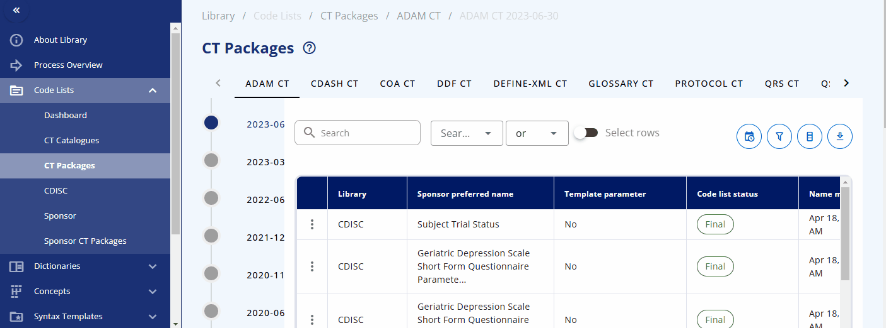
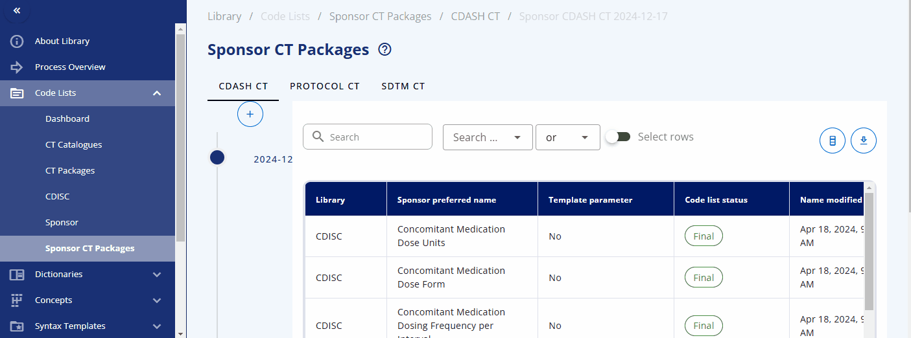

# Library Demonstration {: class="guideH1"}

(created 2025-01-20 using v0.12.1) 
{: class="guideCreated"}

The following animations give a quick demonstration of the OpenStudyBuilder platform. A more detailed video is available in [YouTube](https://www.youtube.com/watch?v=dL5CY0BwfEs){target=_blank}.

The library is the central place to manage all your standards, this includes controlled terminology (code lists), dictionaries, concepts like those for activities - also called Biomedical Concepts (BCs), Units and standard CRFs. You can define protocol standards in syntax templates and instances to support free text but with semantic meaning which is currently used for objectives, endpoints, time frames, criteria, and more. You can browse data exchange standards like SDTM. Furthermore, you can create the clinical programs and projects to group your studies into these.

## Code Lists

Codelists can be managed in the "Code Lists" section of the library. You can create new codelists, browse available codelists, and search for specific codelists. It is recommended to load, create and update codelists via scripts and the API. But you can also use the web interface to manage these.

### Browsing

In the "CT Catalogues" section, you can **browse** codelists for specific standards like SDTM, ADAM and similar. You can also simply search for a specific codelists with the search field. The table not only provides the results, but provide additional information, like whether the codelist is coming from CDISC, is a sponsor-specific one and also their attributes, for example on whether they are extensible or not.

### Codelist Terms

By pressing the three dots for a codelist, you either can edit the codelist or view it's **terms** and checkout the history. When viewing the terms, a table is displayed showing various attributes and all associated terminology. You can further more edit a term. 

Please remark that each term has next to the CDISC standard attributes the following additional values:

- Sponsor preferred name
- Sentence case name
- Order

You can maintain these additional values to enable for example alternative terminology. For the "sex" codelists, where the CDISC value is "F", in our instance is the sponsor preferred name "female" assigned which enables referencing still the terminlogy from CDISC but use the sponsor preferred name for example in the protocol and the CRF item label.

### Packages & Version Changes

An overview of the **packages** and their versions is available in the "CT Packages" section. Here you can see which packages are available in which version and browse the corresponding terms from that package. 

Another nice feature is to see the version changes of the packages. You can compare for example the SDTM changes from two specific dates and see what codelists has been added, deleted and changed. When clicking a changed codelist, you can see which changes in the terms have been made.

### Sponsor CT Packages

The CDISC Controlled Terminlology is version controlled and manages in packages regularily released and updated by CDISC. To enable also a version control for sponsor specific codelists and sponsor attributes for CDISC codelists, the sponsor CT packages are introduced. 

A sponsor CT package is a label that is associated with codelists and terms at a specific timepoint. This enables the access to tracable items as also sponsor codelists and terms can change over time. By accessing a specific sponsor CT package, you can make sure to receive the codelists and terms from that spefific timepoint without the need to worry on changes which might have occured in between. Of course during a study course, you can update the sponsor CT package to the latest version to get the latest codelists and terms.

A new sponsor CT package can be created under the "Sponsor CT Packages" area by selecting the plus button. You can select the corrsponsing standard catalog and CDISC package version. This will create a collection of codelists with their terms for a specific version including CDISC and sponsor specific codelists.

## Dictionaries

The "Dictionaries" section of the library is the place to browse your dictionaries. Also here it's meant to use scripts to load the dictionaries. In Novo Nordisk, only relevant terms from the corresponding dictionaries are loaded into the library. This is done to keep the library clean and to avoid loading unnecessary terms. Loading dictionaries into the OpenStudyBuilder library is done to enable linkage and downstream usage of these items.

Curently the following dictionaries are loaded into the OpenStudyBuilder:

- SNOMDED
- MED-RT
- UNII
- UCUM

## Activitiy Concepts

The activitiy concepts are the Biomedical Concepts (BC) as used within the OpenStudyBuilder. Here activities like laboratory tests are defined and linked to various additional information like the correspondance to SDTM domains, belonging protocol section and much more.

It is recommended to read the guide about activity concepts to get a better understanding on how this is working ([see here](./guide_activity_concept.md)).

