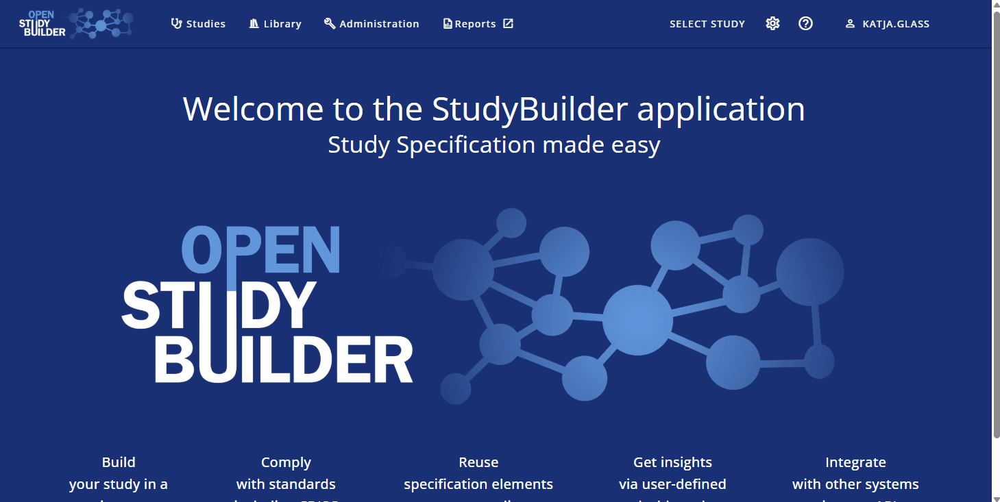
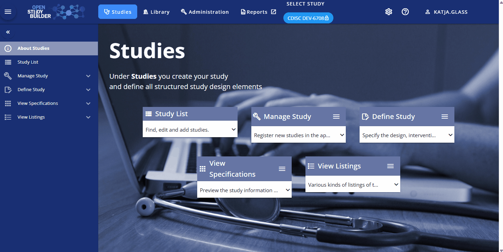
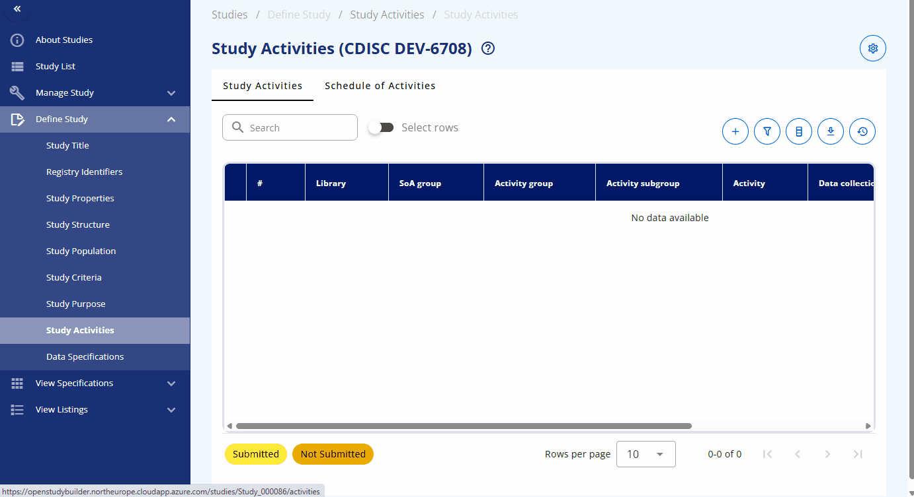

# Study Creation Demonstration {: class="guideH1"}

(created 2025-04-29 using v0.14)  
{: class="guideCreated"}

This demonstration provides a step-by-step guide on how to create a study. For this purpose, we can use the **CDISC Pilot Study** as an example. The corresponding **clinical protocol** is available [here](https://wiki.ihe.net/images/4/47/Lzzt_protocol_redacted.pdf){target=_blank}.  Alternatively, we can utilize the **USDM (Unified Study Definitions Model)** representation of the study. An example of the USDM 3.0 representation of this protocol is available. The **Excel USDM** file, created by data4knowledge, can be accessed [here](https://github.com/data4knowledge/study_definitions_workbench/tree/main/docs/examples/Excel){target=_blank} (file dated 12 November 2024).  

## Create Study

To begin, we need to create a new study that will belong to a project specific to a clinical program. The study requires a **study number** and an **acronym**, both of which can be customized. By default, the study number has a maximum length of 4 characters, but this can be adjusted in the **Settings** menu (accessible from the top-right corner).

We will create a new study with the following details:

- **Project**: CDISC DEV
- **Study Number**: 6708
- **Acronym**: LZZT

## Manage Study 

The **Manage Study** view allows you to maintain its versions, subparts, protocol versions (planned for future updates), and applicable data standards. Core attributes such as the study name, acronym, clinical program, and project are displayed to show the study's context.

In the **Study Status** area, you can lock the study to create a new main version or unlock it to enable editing. This feature ensures proper version control and traceability. For complex studies, multiple subparts can be managed through the **Study Subparts** area. As an example, many Phase 1 studies utilize subparts due to the complexity of their schedules of activities.

Although protocol version management is not yet implemented, it is planned for future updates. 

Another aspect of study management is defining the applicable standards. The **Data Standards Versions** section allows you to link controlled terminology and other standards from specific version to the study. Controlled terminology typically involves a combination of a specific CDISC standard version and a corresponding sponsor standard version for packages like SDTM, ADaM, or CDASH. These standards are expected to be managed in the library and can be selected as needed. This linkage impacts on the concrete terminology used as the linked version is fixes the values.

The **Dictionaries** and **Data Exchange** standards are also intended to link to specific versions, but this functionality is still under development. 

## Define Study

The most important section to create the study content is the **Define Study** section. 

### Study Epochs (Structure)

The different study epochs can be defined in this area. 

There are four different types of epochs:

- **Pre-treatment**: The period before the treatment phase, during which subjects may undergo additional evaluations or assessments to establish a baseline for comparison with post-treatment data.
- **Treatment**: The period during which subjects receive the study treatment or intervention.
- **No-Treatment**: The period during which subjects do not receive any treatment or intervention, often used for comparison with the treatment group.
- **Post-treatment**: The period after the treatment phase, during which subjects are monitored for any long-term effects or outcomes of the treatment. 

For each epoch type, there are also various sub-types available. For example, the **Screening** sub-type is available for the **Pre-treatment** epoch. The sub-type is based on a CDISC codelist to ensure consistency and compliance.

### Study Visits (Structure)

The **Study Visits** section allows you to define the visits for the study. There are different visit types available. Visits are anchored and relative to other visits. This "anchoring" helps maintain the relationship between visits. Detailed options and functionality related to visits are described in the system documentation [here](https://openstudybuilder.northeurope.cloudapp.azure.com/doc/guides/userguide/studies/guide_visits.html){target=_blank}.

In general, the "Scheduled Visit" is the most commonly used type. Typically, you would define one anchoring visit first, which is usually the first treatment visit. Afterward, you can create additional visits by linking them to the anchor visit and specifying their respective window days.

### Study Activities

The Schedule of Activities (SoA) is a crucial part of the study design. It outlines the activities that will be performed during each visit. The SoA is defined in the **Study Activities** section, where you can assign activities and associate them to visits.

When a study activity should be added, ideally activities from the library or another study should be used. It is also possible to request a new activity request which needs to be processed by a standards developer. It is easy to assign multiple activities at once by selecting the tickbox for each activity. The search could be used to filter the activities, select the corresponding one, search for the next and so on. For the grouping it makes sense to assign them either all to one group and change other later on or to add the bunch of activities of one group and then continue with the next group.

