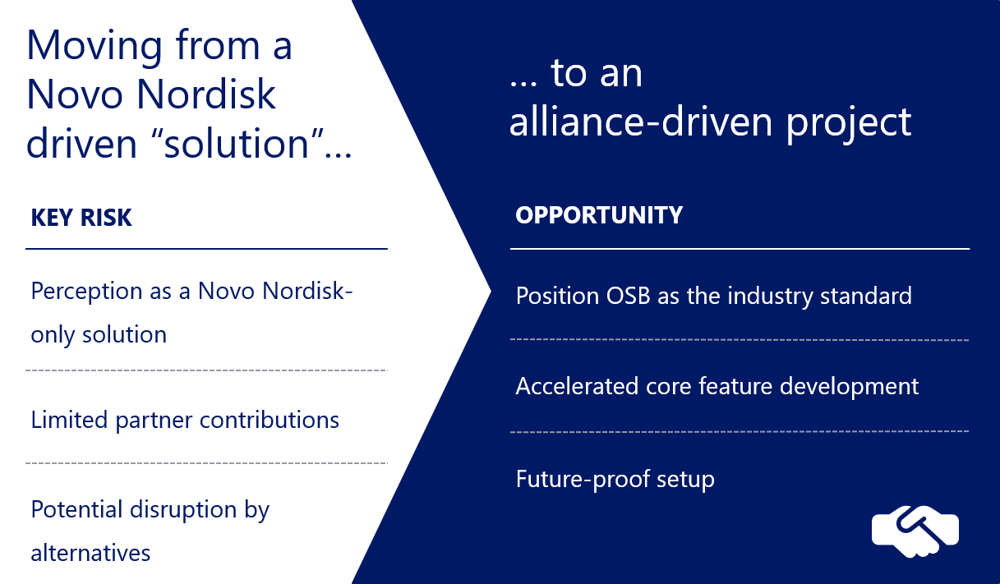
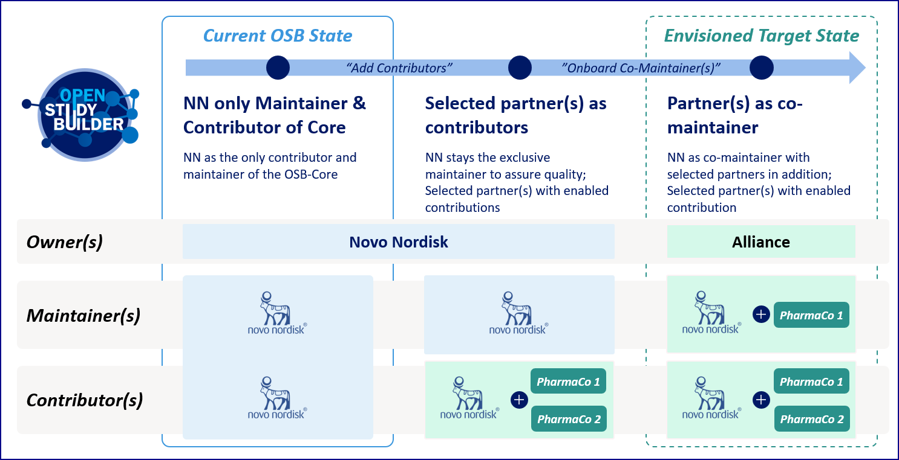
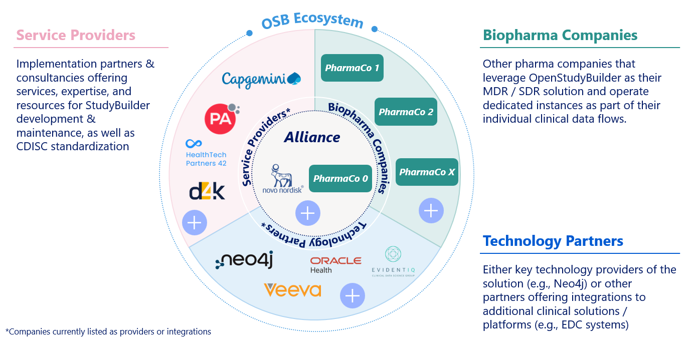

# Open Source Strategy and Rationale

**OpenStudyBuilder** is a next-generation solution for end-to-end clinical data standards and study specifications. It enables study data tools to access structured metadata that reduces manual, document-driven processes and supports automation through a Digital Data Flow approach.

??? tip "Description"
    Already **today**, OpenStudyBuilder is used to manage structured study protocol elements, enabling downstream support for Word Protocol, ICH M11, USDM, Trial Registration and creating a pre-define.xml.

    Expecting to come in **2025**, is the management of industry standards with extensions and enrichments, including protocol standards, as well as the management of a CRF library to enable EDC automation.

    In **long term**, OpenStudyBuilder will evolve to manage a CRF library to fully drive EDC automation, manage mapping specifications to enable automated data transformation, and become a plug-and-play ecosystem where modular functionalities integrate seamlessly with other solutions through standards-driven data flows.

The OpenStudyBuilder implements the digital data flow as envisioned by the TransCelerate [DDF](https://www.transceleratebiopharmainc.com/initiatives/digital-data-flow/){target=_blank} initiative. Furthermore, we are a core part of showcasing standards end-to-end implementations in the CDISC [360i](https://www.cdisc.org/cdisc-360i){target=_blank} initiative.

Guided by this vision, we made the strategic decision to open source OpenStudyBuilder - laying the foundation for a shared, standards-driven solution through an alliance that invites collaboration and accelerates transformation across the industry.

## Why Open Source?

Novo Nordisk has decided to open source the OpenStudyBuilder solution to enable the industry to benefit from a shared metadata and study definition foundation to accelerate trial design, conduct and submission by increasing consistency, improving efficiency, and driving automation.

The strategy is rooted in the belief that digital transformation in clinical development requires collaboration, transparency, and reusable tools. By sharing OpenStudyBuilder as open source, we aim to foster community contributions, reduce redundant proprietary development, and collectively move towards an interoperable, standards-driven ecosystem.

This decision was shaped by several key motivations:

- **Implementing the End-to-End Vision**: Inspired by the potential of CDISC 360 and Digital Data Flow (DDF), we saw the need for a solution that operationalizes their vision - enabling fully connected, machine-readable, and standards-driven study definitions. Open source provides the transparency and collaboration needed to turn this vision into reality.

- **Limited Existing Solutions**: We observed a lack of tools that support the CDISC 360 and DDF visions or offer the critical functionality. By open sourcing OpenStudyBuilder, we enable the broader community to close this gap together.

- **Avoiding Legacy Pitfalls**: Rather than building yet another proprietary, monolithic system, we designed OpenStudyBuilder to be modular, standards-based, and integration-friendly. Open source ensures it remains adaptable and free from vendor lock-in.

- **Reducing Integration Overhead**: System integration is a major pain point across clinical development. With open APIs, shared data models, and an open-source architecture, OpenStudyBuilder reduces the need for custom integration work and simplifies connectivity across tools.

- **Leveraging Community Insight**: By opening the solution, we gain valuable input from experts outside our organization - helping us stay aligned with current best practices, emerging standards, and evolving user needs. This ensures we avoid isolated development and keep the solution modern, relevant, and future-proof.

- **Balancing Investment and Risk**: Open source allows the cost and responsibility of building and maintaining such a solution to be shared. It reduces duplication of effort and spreads the risk across organizations with common goals.

OpenStudyBuilder has the potential to become a **de facto industry standard** - enabling a modular, interoperable ecosystem where connected solutions exchange data seamlessly, supporting a fully digital workflow without the need for manual handovers or document-driven processes.

## Collaborative Path Forward

While OpenStudyBuilder was initially developed by Novo Nordisk, our long-term vision is to establish it as an industry-wide collaborative solution. To support this transition, we are moving from a Novo Nordisk driven initiative to a collaborative, alliance-driven open source project.

### Key Risks

We recognize several key risks that make this collaborative approach essential:

- **Perception as a Novo Nordisk-only solution**  
  There is a risk that peers in the pharmaceutical industry perceive OpenStudyBuilder as a proprietary Novo Nordisk tool, leading them to favor commercial off-the-shelf alternatives. This could fragment the ecosystem and create competing de facto standards.

- **Limited partner contributions**  
  Although partners have contributed useful integrations, we've found that it's inherently challenging for a pharmaceutical company to contribute to a project led by another. This dynamic often limits deeper involvement, especially in core feature development. To enable true collaboration, a more neutral, shared project is needed.

- **Potential disruption by alternatives**  
  Competing platforms may gain traction if other pharmaceutical companies invest heavily in them, while OpenStudyBuilder remains dependent on a single sponsor for evolution and maintenance.

### Opportunities

To address these risks and unlock the full potential of OpenStudyBuilder, we are actively transitioning toward the creation of a collaborative industry alliance supported by a clear contribution and governance model. This shift opens up several key opportunities:

- **Positioning OpenStudyBuilder as the industry standard**  
  A broad, collaborative effort prevents the perception of vendor lock-in and strengthens OpenStudyBuilder's positioning as a shared, standards-aligned solution that supports the TransCelerate DDF and CDISC 360i vision.

- **Accelerated core feature development**  
  By establishing an alliance of multiple pharmaceutical companies, we can scale the development of core features, share maintenance responsibilities, and extend the platform to support additional processes, integration capabilities, and a diverse set of use cases across the clinical development lifecycle.

- **A future-proof, resilient ecosystem**  
  A diverse alliance of pharma companies and service providers ensures ongoing innovation and reduces the risk of disruption. Shared ownership strengthens continuity and competitive advantage over fragmented alternatives.

## Shifting to an Alliance

The ownership and governance of OpenStudyBuilder is transitioning from a Novo Nordisk-led initiative to a collaborative alliance model. This shift is designed to ensure that the solution evolves in alignment with industry needs, while enabling sustainable and transparent collaboration.

As OpenStudyBuilder is a complex solution already used in production, this transition must be carefully planned and executed. As a first step, we now enable pharmaceutical companies to join as contributors. To support this, we have established a [Contributor License Agreement (CLA)](info_contribution.md#contributor-license-agreement-cla) to provide legal clarity and protect the interests of all parties involved.

During this initial phase, the details of the alliance model are being defined and shaped in close collaboration with pharma companies interested in becoming alliance members. The goal is to establish a governance framework that ensures transparency, shared ownership, and a clear, structured path for contributions from all members.

If you are interested in **joining the alliance** - helping to own, maintain, and develop the OpenStudyBuilder solution - please contact us via [email](mailto:openstudybuilder@gmail.com){target=_blank}.

In addition to alliance members, the broader OpenStudyBuilder ecosystem will also include:

- **Biopharma Companies** - Other pharmaceutical companies using OpenStudyBuilder as their Metadata Repository (MDR) or Study Definition Repository (SDR) solution, operating their own instances as part of internal clinical data flows.
- **Technology Partners** - Key technology providers (e.g., Neo4j) or organizations offering integrations with clinical solutions and platforms, such as Electronic Data Capture (EDC) systems.
- **Service Providers** - Implementation partners and consultancies offering services, technical expertise, and resources for OpenStudyBuilder development, CDISC standardization, and system integration.

If you would like to be listed as a [service provider](info_services.md) or [integration partner](info_integrations.md), please reach out via [email](mailto:openstudybuilder@gmail.com){target=_blank}.

