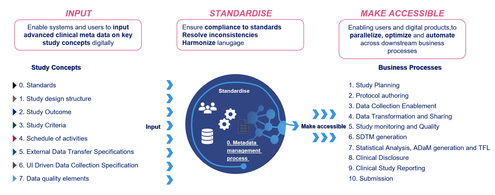
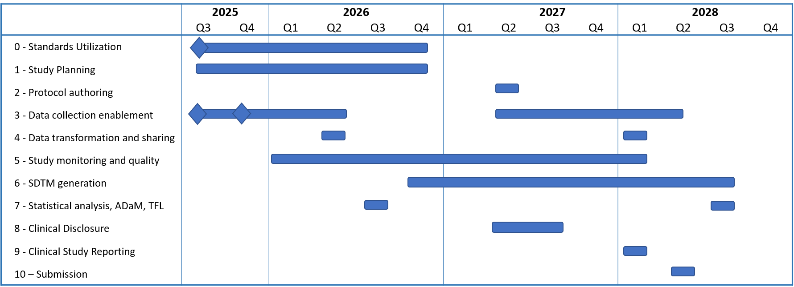
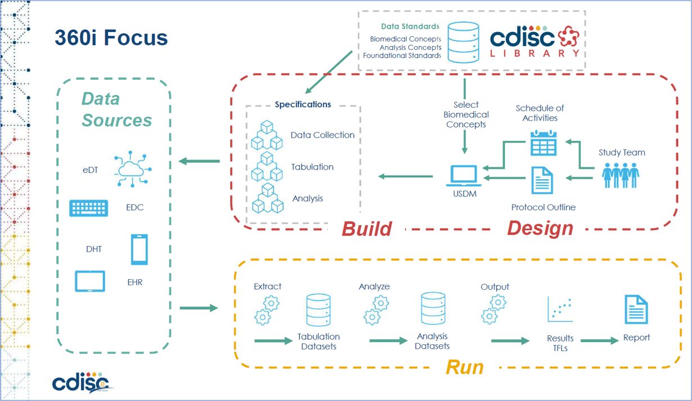

# Scope & Direction of the Project

## Our Road Ahead - The Vision

The OpenStudyBuilder is designed to enable true end-to-end automation across clinical trial processes. But what does that really mean in practice?

To bring this vision into focus, we've developed a value framework for OpenStudyBuilder - clarifying its role, guiding our planning, and laying the groundwork for a solid roadmap. Though grounded in Novo Nordisk's specific needs, the framework reflects common challenges and opportunities that are shared across the broader pharmaceutical industry.

{: class="imageParagraph"}

Figure 1: Vision of inputs and business processes which aims to be supported by OpenStudyBuilder
{: class="imageDescription"}

At the heart of this vision are the structured inputs that users and systems provide digitally. Among these, standards are the most critical - they form the foundation for every other input and transformation. This includes global data standards like CDISC, sponsor-specific standards, Biomedical Concepts, CRF libraries, and more.

Once provided, these inputs are processed within the OpenStudyBuilder. The tool serves as a harmonization layer, aligning language, applying standards, resolving inconsistencies, and preparing structured outputs for downstream use.

The real value emerges when the same structured information - like a digitally defined protocol - can seamlessly feed into multiple business processes. This allows both users and systems to access consistent metadata, enabling parallelization, automation, and optimization across the entire clinical trial lifecycle.

The business processes supported by this vision span the full trial road - from study planning and protocol authoring, through data collection enablement, data transformation, SDTM generation, and statistical analysis (ADaM/TFLs), to clinical trial discloser, study reporting and regulatory submission.

As all of these processes depend on standards, a crucial element on the consumption side is standards utilization. This is what enables interoperability between tools and ensures consistency throughout the trial setup and execution.

## Where Do We Stand Now

OpenStudyBuilder is already delivering tangible value in the area of protocol authoring. At Novo Nordisk, it is used in production to define structured protocol elements - most notably the Schedule of Activities (SoA) - and automatically populate them into the corresponding Word-based protocol template. 

Initially, Phase 1 studies were out of scope due to the complexity of their SoA designs. However, with the recent implementation of functionality supporting study sub-parts and multiple SoAs, we are now preparing for the onboarding of Phase 1 protocols as well.

{: class="imageParagraph"}

Figure 2: Current live business processes
{: class="imageDescription"}

In parallel with supporting protocol authoring, the project has placed strong emphasis on enabling standards utilization for downstream systems and laying the groundwork for data collection automation - two areas that are set to become key focal points in the near future.

## Where to Go Next

For the remainder of 2025, the project will focus on two strategic priorities: enabling standards utilization and advancing data collection automation. In parallel, we will work on supporting study planning activities, though with a more limited scope compared to the primary focus areas.

The first priority is to make structured metadata broadly accessible to downstream systems in a version-controlled, consolidated, and harmonized manner. A key milestone here is the enablement of some missing functionalities as metadata repository, which is expected to go into production and replace a legacy tool.

The second focus area is enhancing our support for data collection. This includes refining CRF design capabilities, strengthening the integration of Biomedical Concepts, and advancing automation features that support EDC setup.

While OpenStudyBuilder is not intended to execute all of these processes directly, it will serve as a central hub that enables them. To support this role, the underlying data model, standards content, and API infrastructure must be in place and aligned.

{: class="imageParagraph"}

Figure 3: Rough Roadmap Timeline
{: class="imageDescription"}

Looking ahead to 2026 and beyond, we plan to expand support across additional business processes. The roadmap provides a high-level view of when these areas may be addressed, with flexibility to adjust as priorities evolve. Once standards utilization is fully in place, processes such as SDTM generation, ADaM workflows, and TFL production can be supported more effectively, given their existing reliance on structured metadata. Beyond metadata utilization we focus on now, we identified additional requirements in those areas, which are scheduled for 2026 and beyond.

## The Role of CDISC 360i

The CDISC 360i project will play a central role in demonstrating how the end-to-end flow can function by showcasing the integration of tools and the complete data flow, all driven by industry standards for data and exchange. It brings together experts and tool developers to execute and evaluate the flow and drive improvements, aiming to implement the full process from study planning, through data collection, to SDTM and ADaM generation and beyond, leveraging tools and practices. OpenStudyBuilder will be one of the key solutions to support and showcase this collaborative, end-to-end automation.
 

{: class="imageParagraph"}

Figure 4: CDISC 360i Project Focus
{: class="imageDescription"}

Through CDISC 360i, we will explore how data and metadata can seamlessly flow across different solutions to support various use cases. The project is being developed in parallel across multiple workstreams. A key stream, the "run" phase, focuses on the full data lifecycle - from collection to SDTM and ADaM mapping, through to the final ARD and TFL generation.

In addition, for the "design" phase - where protocol information is collected, managed, and provided - multiple solutions will be integrated. With data flowing smoothly from one system to another, driven by structured protocols, there is significant potential for further process improvements beyond what we currently envision for OpenStudyBuilder. With well-defined transfer standards, integrating and exchanging applications could become as simple as selecting tools from a digital marketplace.

The CDISC 360i project is still in its early stages, but its potential to drive industry-wide harmonization is immense. By not only aligning data standards but also improving the tools and integrations used throughout the clinical trial process, it promises to reshape the way we approach clinical trials. The project's success will have a significant impact on how OpenStudyBuilder is utilized, enhancing business processes and enabling more seamless, automated workflows across the entire clinical trial lifecycle.
